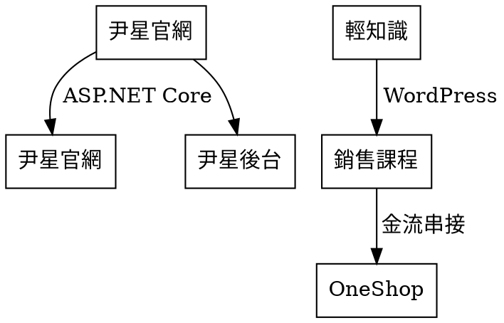

## 關聯表

```graphviz
digraph hierarchy {

  # 過程
  node[shape=box]
  a [label="尹星官網"]
  b [label="輕知識"]


  # 連線邏輯

  a->尹星官網 [label=" ASP.NET Core"]
  a->尹星後台 
  b->銷售課程 [label=" WordPress"]
  銷售課程-> OneShop [label=" 金流串接"]

}
```